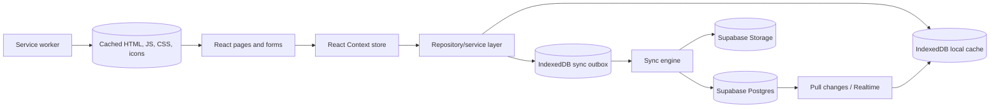

# Offline-First and Supabase Synchronization Guide

## Purpose

This document describes how to evolve the Tutorial Clinic front end into an offline-first Progressive Web App (PWA) that:

- Opens and displays recently synchronized information without internet access.
- Generates and displays previously prepared QR codes without internet access.
- Scans QR codes and records attendance while offline.
- Saves student changes in the student's browser immediately.
- Automatically synchronizes queued changes to Supabase when a usable connection returns.
- Prevents duplicate uploads and handles conflicts safely.

This is an implementation plan, not a claim that the current browser-only demo already synchronizes with Supabase.

## Important expectations

1. A student must successfully open the deployed application online at least once. The service worker can then cache the application shell for later offline use. A browser cannot download an application it has never visited.
2. Supabase is the cloud database, but it is not the browser's offline database. IndexedDB must hold the local cache and pending changes.
3. `navigator.onLine` is only a hint. A device may be connected to Wi-Fi while Supabase is unreachable. A change is **Synced** only after Supabase acknowledges it.
4. Automatic synchronization while the app is open is reliable through startup, reconnect, visibility, and retry triggers. Synchronization after the browser is completely closed is not guaranteed on every browser because the Background Sync API has limited availability. [MDN documents this browser limitation](https://developer.mozilla.org/en-US/docs/Web/API/Background_Synchronization_API).
5. Offline changes are stored only in that browser until synchronization succeeds. Clearing site data, using private browsing, browser storage eviction, or losing the device can remove unsynchronized data.
6. Browser storage is not a secure replacement for authentication or server authorization. Do not store a password, Supabase service-role key, private QR-signing key, or other server secret in IndexedDB or localStorage.

## What the project already has

The existing front end already provides a useful starting point:

- `src/context/AppDataContext.tsx` centralizes application state.
- `tutorial-clinic:demo:v1` persists the current demo snapshot in localStorage.
- `src/utils/fileStorage.ts` stores note files in IndexedDB.
- `qrcode.react` generates QR images in the browser without requesting an external QR service.
- `src/services/index.ts` provides a boundary that can be replaced by real data adapters.
- The top-level application already detects online and offline browser events.

The missing production pieces are:

- A PWA service worker and web app manifest.
- Per-record IndexedDB storage instead of relying on one large localStorage snapshot.
- A durable synchronization outbox.
- Supabase remote adapters.
- Conflict and retry rules.
- Server-side authorization, validation, idempotency, and QR signing.

## Recommended architecture



Use each layer for one purpose:

- **Service worker/Cache Storage:** the application shell and static assets.
- **IndexedDB local cache:** structured application records and local files. IndexedDB supports significant structured data and blobs and is designed for online/offline web applications. [MDN IndexedDB guide](https://developer.mozilla.org/en-US/docs/Web/API/IndexedDB_API).
- **IndexedDB outbox:** changes waiting to be sent to Supabase.
- **React Context:** the current in-memory UI projection.
- **Supabase Postgres:** authoritative shared records.
- **Supabase Storage:** uploaded PDFs and images.
- **Supabase Realtime:** optional live updates while connected; it is not a replacement for the local cache or reconnect pull. [Supabase Realtime overview](https://supabase.com/docs/guides/realtime).

## Online and offline behavior by feature

| Feature | Offline behavior | After reconnecting |
|---|---|---|
| Dashboard and recent activity | Display the latest cached snapshot with a “Last updated” time | Pull newer activity and replace/merge the cache |
| Sessions and announcements | Display cached records | Pull records changed since the last sync cursor |
| RSVP | Save locally as `Pending sync`; do not guarantee the seat | Server checks capacity; mark `Synced` or `Rejected: session full` |
| My Schedule | Add/remove locally and queue the change | Upsert or delete the schedule record |
| Attendance | Store scan payload, event ID, student ID, and scan time as `Pending sync` | Server verifies the signed token, time window, student, event, and duplicate rule |
| Note draft | Save metadata and selected file in IndexedDB | Upload the file first, then upsert its note metadata |
| Favourite note | Toggle locally | Upsert/delete the student's favourite record |
| Notification read state | Update locally | Upsert the read timestamp |
| Points and leaderboard | Show last synchronized value, clearly labelled | Refresh from server; never award authoritative points only in the browser |
| Admin approval | Prefer online-only; optionally queue with a warning | Server re-checks role and current record version before applying |

Server-authoritative results such as capacity, attendance approval, note approval, points, and leaderboard rank must be labelled as cached while offline.

## Recommended packages

Install these only when Supabase integration begins:

```bash
npm install @supabase/supabase-js idb
npm install --save-dev vite-plugin-pwa
```

- `@supabase/supabase-js`: Supabase Auth, Postgres, Storage, and Realtime client.
- `idb`: small typed wrapper around IndexedDB. Native IndexedDB can also be used if the team prefers no wrapper.
- `vite-plugin-pwa`: creates the service worker and manifest for the existing Vite application. Its official project documents offline support through Workbox. [vite-plugin-pwa project](https://github.com/vite-pwa/vite-plugin-pwa).

Keep `qrcode.react`; QR generation is already local. Do not load a QR generator, scanner, font, icon, or critical JavaScript bundle from a CDN if it must work offline.

## Phase 1: Cache the application shell

Add `vite-plugin-pwa` to `vite.config.ts`:

```ts
import { VitePWA } from "vite-plugin-pwa";

VitePWA({
  registerType: "prompt",
  includeAssets: ["favicon.svg", "icons/*.png"],
  manifest: {
    name: "CCS Tutorial Clinic",
    short_name: "Tutorial Clinic",
    description: "Offline-ready tutorial clinic student portal",
    theme_color: "#12372a",
    background_color: "#f7faf8",
    display: "standalone",
    start_url: "/",
    icons: [
      { src: "/icons/pwa-192.png", sizes: "192x192", type: "image/png" },
      { src: "/icons/pwa-512.png", sizes: "512x512", type: "image/png" },
      {
        src: "/icons/pwa-512-maskable.png",
        sizes: "512x512",
        type: "image/png",
        purpose: "maskable",
      },
    ],
  },
  workbox: {
    cleanupOutdatedCaches: true,
    navigateFallback: "/index.html",
    globPatterns: ["**/*.{js,css,html,svg,png,ico,woff2}"],
  },
});
```

Use an update prompt rather than silently replacing the currently running application during an unsynchronized edit. Apply the update after the outbox is saved and the user accepts it.

Do not blindly cache authenticated Supabase REST responses in Cache Storage. They can become stale and can leak data between students sharing the same browser. Cache authenticated application data by user ID in IndexedDB instead.

Service workers require HTTPS in production; browsers allow `localhost` for development. [MDN Service Worker API](https://developer.mozilla.org/en-US/docs/Web/API/Service_Worker_API).

## Phase 2: Replace the single snapshot with a structured local database

Create a new IndexedDB database:

```text
tutorial-clinic-offline, version 1
├── entities       cached records, keyed by [userNamespace, entityType, entityId]
├── outbox         pending mutations, keyed by mutationId
├── files          note file blobs, keyed by fileId
├── syncMeta       pull cursor, last successful sync, device ID, schema version
└── conflicts      mutations requiring user/admin attention
```

Suggested types:

```ts
type EntityType =
  | "profile"
  | "event"
  | "rsvp"
  | "schedule"
  | "attendance"
  | "note"
  | "favourite"
  | "notification"
  | "announcement";

type MutationOperation = "upsert" | "delete" | "upload-file";
type MutationStatus = "pending" | "syncing" | "failed" | "conflict";

interface OutboxMutation {
  mutationId: string;          // crypto.randomUUID(); also used for idempotency
  userId: string;
  deviceId: string;
  entityType: EntityType;
  entityId: string;
  operation: MutationOperation;
  payload: unknown;
  baseVersion?: number;
  dependsOn?: string[];        // note metadata can depend on its file upload
  createdAt: string;
  retryCount: number;
  nextRetryAt?: string;
  status: MutationStatus;
  lastError?: string;
}
```

Store the local entity update and its outbox mutation in the **same IndexedDB transaction**. This prevents a browser interruption from saving the UI change without also saving the work needed to upload it.

Use localStorage only for small non-authoritative preferences if desired. Do not continue synchronizing the complete `DemoState` JSON object to Supabase; doing so would overwrite unrelated students' records and cause severe conflicts.

## Phase 3: Add repositories and adapters

Keep UI components unaware of Supabase:

```text
src/
├── offline/
│   ├── database.ts
│   ├── entityRepository.ts
│   ├── outboxRepository.ts
│   ├── migration.ts
│   └── storageEstimate.ts
├── sync/
│   ├── syncEngine.ts
│   ├── conflictResolver.ts
│   ├── retryPolicy.ts
│   └── syncTypes.ts
├── services/
│   ├── repositories.ts
│   ├── local/
│   │   └── localDataAdapter.ts
│   └── supabase/
│       ├── client.ts
│       ├── authAdapter.ts
│       ├── eventAdapter.ts
│       ├── attendanceAdapter.ts
│       ├── noteAdapter.ts
│       └── syncAdapter.ts
├── hooks/
│   ├── useNetworkStatus.ts
│   └── useSyncStatus.ts
└── components/offline/
    ├── ConnectionBanner.tsx
    ├── SyncStatusBadge.tsx
    └── SyncIssuesPanel.tsx
```

Example repository contract:

```ts
interface EventRepository {
  getCachedEvents(userId: string): Promise<DemoEvent[]>;
  saveEventLocally(event: DemoEvent): Promise<void>;
  queueRsvp(userId: string, eventId: string, attending: boolean): Promise<string>;
  pullRemoteChanges(cursor?: string): Promise<{ events: DemoEvent[]; cursor: string }>;
}
```

`AppDataContext` can keep its current public actions. Internally, each action should update the in-memory state, persist the record to IndexedDB, and enqueue a mutation. This permits gradual migration without redesigning pages.

## Phase 4: Configure the Supabase client

Use public environment variables:

```env
VITE_SUPABASE_URL=
VITE_SUPABASE_PUBLISHABLE_KEY=
```

```ts
import { createClient } from "@supabase/supabase-js";
import type { Database } from "./database.types";

export const supabase = createClient<Database>(
  import.meta.env.VITE_SUPABASE_URL,
  import.meta.env.VITE_SUPABASE_PUBLISHABLE_KEY,
  {
    auth: {
      persistSession: true,
      autoRefreshToken: true,
    },
  },
);
```

Supabase's browser client persists its session by default, but a cached session does not guarantee that every offline action will still be authorized later. The sync engine must handle expired sessions and request login before uploading. [Supabase JavaScript Auth reference](https://supabase.com/docs/reference/javascript/auth).

Never put `SUPABASE_SERVICE_ROLE_KEY` or a secret key in a `VITE_` variable. Vite variables are included in the browser bundle. Use only the publishable client key and enforce access with Row Level Security (RLS). Supabase states that RLS should be enabled on exposed tables and can be combined with Supabase Auth. [Supabase RLS guide](https://supabase.com/docs/guides/database/postgres/row-level-security).

## Phase 5: Supabase records required for synchronization

Suggested tables:

- `profiles`
- `subjects`
- `events`
- `rsvps`
- `schedule_items`
- `attendance_submissions`
- `notes`
- `note_favourites`
- `notifications`
- `announcements`
- `point_transactions`
- `processed_mutations`

Every synchronizable table should normally contain:

```text
id UUID primary key                 generated by the client or server
user_id UUID                       owner where applicable
created_at timestamptz             server default
updated_at timestamptz             server maintained
version bigint                     increments on each accepted update
deleted_at timestamptz nullable    tombstone for synchronized deletion
last_mutation_id UUID nullable     idempotency/audit reference
```

Add database constraints such as:

- Unique RSVP: `(user_id, event_id)`.
- Unique schedule item: `(user_id, event_id)`.
- Unique attendance submission: `(user_id, event_id)` for a non-rejected final record.
- Unique favourite: `(user_id, note_id)`.
- Unique processed mutation: `mutation_id`.

Use client-generated UUIDs so a record can receive a permanent ID before internet access exists. Supabase upserts use identifying conflict columns to update the intended record. [Supabase JavaScript upsert reference](https://supabase.com/docs/reference/javascript/upsert).

The backend teammate must provide:

- Supabase Auth mapping between a student account and `profiles.id`.
- RLS policies for students, contributors, and administrators.
- Storage policies for private note files.
- Database functions for operations that must be atomic.
- Server-side QR token signing and validation.
- Unique constraints and idempotency checks.
- Server-maintained point awards and audit history.

## Phase 6: Save locally first and synchronize second

For every student change:

1. Validate it in the UI.
2. Create stable IDs with `crypto.randomUUID()`.
3. Write the changed record to IndexedDB.
4. Write an outbox mutation in the same transaction.
5. Update React state immediately.
6. Display **Saved on this device — waiting to sync**.
7. Ask the sync engine to run if a connection might be available.

Simplified mutation code:

```ts
async function saveOfflineFirst<T>(entity: LocalEntity<T>, mutation: OutboxMutation) {
  const database = await getOfflineDatabase();
  const transaction = database.transaction(["entities", "outbox"], "readwrite");

  await transaction.objectStore("entities").put(entity);
  await transaction.objectStore("outbox").put(mutation);
  await transaction.done;

  syncEngine.requestSync();
}
```

Run synchronization on:

- Application startup.
- The browser `online` event.
- Returning to a visible tab.
- Supabase session refresh or login.
- A short retry timer while the app is open.
- The user's **Sync now** button.
- Background Sync as an enhancement on supported browsers.

Use exponential retry delays with jitter, for example 2 seconds, 5 seconds, 15 seconds, 1 minute, and 5 minutes. Do not retry validation, authorization, conflict, or capacity errors forever; move them to **Needs attention**.

## Sync engine outline

```ts
async function synchronize() {
  if (syncLock.isLocked()) return;

  await syncLock.runExclusive(async () => {
    const session = await authAdapter.getValidSession();
    if (!session) return;

    const mutations = await outboxRepository.getReadyMutations(session.user.id);

    for (const mutation of mutations) {
      try {
        await outboxRepository.markSyncing(mutation.mutationId);
        const result = await remoteSyncAdapter.applyMutation(mutation);
        await localRepository.applyServerResult(result);
        await outboxRepository.remove(mutation.mutationId);
      } catch (error) {
        await handleSyncError(mutation, error);
        if (isNetworkError(error)) break;
      }
    }

    const cursor = await syncMetaRepository.getPullCursor(session.user.id);
    const changes = await remoteSyncAdapter.pullChanges(cursor);
    await localRepository.mergeServerChanges(changes);
    await syncMetaRepository.savePullCursor(changes.nextCursor);
  });
}
```

Process dependent operations in order. A note file upload must succeed before its note metadata can reference the Supabase Storage path.

### Idempotency

Network failure can happen after Supabase accepts a write but before the browser receives the response. Retrying the same mutation must not create a duplicate.

- Generate one `mutationId` and keep it for every retry.
- Add a unique constraint for processed mutation IDs.
- Prefer a Postgres function such as `apply_offline_mutation(mutation_id, type, payload)` for critical workflows.
- Return the already accepted result when the same mutation ID is received again.
- Use stable record IDs and `upsert` for safe ordinary records.

Example ordinary upsert:

```ts
const { error } = await supabase
  .from("schedule_items")
  .upsert(row, { onConflict: "user_id,event_id" });

if (error) throw error;
```

Use a server function for attendance, capacity-limited RSVP confirmation, approvals, and point awards because each of these can require validation and multiple atomic database changes.

## Conflict rules

Define rules before connecting the UI:

| Data | Recommended rule |
|---|---|
| Profile preferences | Newest accepted edit wins; compare server version |
| RSVP | Server capacity is authoritative; offline RSVP remains tentative |
| Schedule item | Unique upsert/delete per student and event |
| Attendance | First valid submission wins; duplicate becomes a resolved no-op |
| Note draft | Compare `baseVersion`; preserve both copies when both changed |
| Note moderation | Server/admin decision wins over an older student edit |
| Notification read state | A read timestamp should not be changed back to unread by an older client |
| Points | Server-only append transactions; browser never overwrites balance |
| Deleted records | Use tombstones so another device does not restore a deleted record |

If an edit has a stale `baseVersion`, return a `409`-style conflict result containing the server record. The UI can then show **Keep server version**, **Keep my version**, or **Save as a copy** where appropriate.

## Offline QR generation and scanning

### QR generation

`qrcode.react` renders a QR from a local string, so QR generation itself does not need internet after the JavaScript bundle is cached. Precache the application assets through the PWA service worker.

Use a versioned payload instead of only a web URL:

```json
{
  "type": "tutorial-clinic-attendance",
  "version": 1,
  "eventId": "event-uuid",
  "token": "server-signed-token"
}
```

Compact or Base64URL-encode the payload before placing it in the QR if necessary. Keep the payload small for reliable scanning.

### Secure offline attendance flow

1. While online, the admin creates/synchronizes an event.
2. A trusted server function signs an attendance token containing the event ID, allowed time window, and random nonce.
3. The signed token is cached with the event.
4. The admin can display that cached QR while offline.
5. A student can scan it offline and save a pending attendance submission.
6. On reconnect, Supabase validates the signature, time window, event, student identity, mutation ID, and duplicate constraint.
7. Only the server changes the attendance to accepted/approved and awards points.

Never place the signing private key in React, a service worker, IndexedDB, or a `VITE_` environment variable. If offline client-side signature verification is desired, embed only the public verification key; the server must still perform final validation.

If an admin creates a brand-new event while completely offline, the server cannot issue a trusted signed token. The UI may create a **Provisional QR — sync required before verified attendance**, but should not present it as secure. A safer alternative is to pre-issue signed QR tokens while online.

### Scanning

The existing `BarcodeDetector` camera path can scan without internet when the browser supports it. Manual code entry remains the fallback. For broader offline browser support, bundle a scanner library into the application instead of loading one from a CDN.

Record both:

```text
client_scanned_at       device-reported time for presentation
server_received_at      trustworthy server receipt time
qr_valid_from/to        signed attendance window
sync_status             pending, accepted, rejected, conflict
```

Do not trust the device clock alone for points or late/on-time classification. The backend should apply the project's offline attendance policy, for example accepting a signed scan time with an allowed grace period and flagging unusual clock differences for review.

## Offline note-file upload

1. Save the selected `File`/`Blob` in IndexedDB.
2. Create a note metadata record with `syncStatus: "pending"`.
3. Queue an `upload-file` mutation.
4. After reconnecting, upload to a private Supabase Storage bucket using a stable path such as `userId/noteId/fileName`.
5. Queue or execute the note metadata upsert only after upload succeeds.
6. Retain the local blob until both operations are acknowledged.
7. Remove old local blobs after a safe retention period or explicit cache cleanup.

Supabase recommends standard uploads for small files and resumable uploads for files larger than about 6 MB. [Supabase standard uploads guide](https://supabase.com/docs/guides/storage/uploads/standard-uploads). Use private buckets and Storage RLS policies for student submissions.

## User interface requirements

Display a small global status indicator:

- **Online — all changes synced**
- **Online — syncing 3 changes**
- **Offline — 3 changes saved on this device**
- **Sync paused — please sign in again**
- **1 change needs attention**

Every offline-capable record should expose one of:

```text
local-only → pending → syncing → synced
                            └── failed/retry
                            └── conflict/needs attention
```

Add a Sync Issues page or panel containing:

- Record/action name.
- Time saved locally.
- Last error in friendly wording.
- Retry button.
- Discard local change button with confirmation.
- Conflict resolution controls where applicable.

Show **Last successfully updated at ...** on cached dashboards, sessions, announcements, points, and leaderboards. Never show an offline RSVP as a confirmed seat until the server accepts it.

## Authentication and shared-device safety

- Replace the demo Student ID-only login with Supabase Auth or a secure backend-issued session.
- Do not migrate `demoPassword` from the current localStorage demo into the offline database.
- Namespace cached data by the authenticated Supabase user ID.
- On logout, remove the session and offer to remove that student's cached records and pending changes.
- Do not upload another student's outbox after switching accounts.
- Pause synchronization if the session expires; do not delete pending work.
- RLS must restrict students to their own private records and restrict moderation/point changes to administrators.

Supabase browser sessions can persist locally for reconnects, but RLS remains necessary for every exposed table. [Supabase Auth sessions](https://supabase.com/docs/guides/auth/sessions) and [Supabase RLS](https://supabase.com/docs/guides/database/postgres/row-level-security).

## Background synchronization limitations

Implement reconnect synchronization in the React application first. This covers the normal case: the student leaves the page open or returns to it after internet access comes back.

Background Sync can later request a service-worker sync:

```ts
const registration = await navigator.serviceWorker.ready;

if ("sync" in registration) {
  await registration.sync.register("tutorial-clinic-outbox");
}
```

However:

- It requires HTTPS.
- It is not supported by all major browsers.
- A service worker cannot access localStorage.
- A worker-based uploader needs access to IndexedDB and a valid authentication design.
- The browser decides when and whether to run it.

Therefore the product promise should be:

> Changes are saved immediately on this device and synchronize automatically when the application is open again with a valid internet connection. Supported browsers may also synchronize in the background.

Do not promise guaranteed upload while the browser is completely closed.

## Recommended implementation order

1. Add the PWA manifest, service worker, icons, and offline route fallback.
2. Test that the built app opens offline after one online visit.
3. Create the versioned IndexedDB entities and outbox stores.
4. Migrate cached demo records from the current localStorage snapshot.
5. Add repository interfaces and keep React components using those interfaces.
6. Add sync states and the global connection/sync indicator.
7. Connect Supabase Auth and user mapping.
8. Create Supabase tables, constraints, RLS policies, and typed client definitions.
9. Implement pull synchronization and last-sync cursors.
10. Implement outbox uploads for simple personal records.
11. Implement idempotent server functions for RSVP, attendance, moderation, and points.
12. Add signed QR tokens and offline attendance queuing.
13. Add Supabase Storage uploads for note files.
14. Add conflict handling, retry controls, and Realtime refreshes.
15. Add Background Sync only as a progressive enhancement.

## Testing checklist

### Application shell

- Visit online, close the tab, disconnect, and reopen every main route.
- Refresh a nested route while offline.
- Confirm all fonts, icons, styles, and QR rendering work offline.
- Confirm a service-worker update does not lose pending form data.

### Local changes

- Make an RSVP offline, refresh, and confirm it remains pending.
- Scan the same event twice offline and confirm local duplicate prevention.
- Upload a note offline and reopen its local preview after refresh.
- Close the browser during an IndexedDB transaction and verify consistency.
- Fill the browser storage quota and show a useful error.

### Reconnect

- Restore internet and verify pending changes upload automatically.
- Interrupt the connection after the server accepts a mutation but before the response; retry must not duplicate it.
- Expire the session while work is pending and verify the work remains locally.
- Reject an offline RSVP because capacity filled on another device.
- Resolve a two-device note-edit conflict without losing either version.
- Confirm one attendance approval produces only one point award.

### Security

- Confirm a student cannot sync a mutation for another student.
- Confirm a non-admin cannot approve attendance, moderate notes, or adjust points.
- Confirm the service-role key and QR private signing key do not exist in the browser bundle.
- Confirm logging out prevents the next student from viewing cached private records.

## Definition of done

The offline-first integration is ready when:

- The installed/cached application opens without internet after an initial online visit.
- Recent authorized data is readable from IndexedDB.
- QR codes for already synchronized events render offline.
- Offline scans and student changes survive refresh and browser restart.
- Pending changes show clear per-record sync status.
- Reconnect synchronization is automatic while the app is active or reopened.
- Retries cannot duplicate RSVP, attendance, note, favourite, or point records.
- Capacity and conflict rejections produce clear recovery actions.
- Supabase RLS protects every exposed table and private Storage bucket.
- Points, approvals, and QR trust decisions remain server-authoritative.
- Background Sync is treated as an optional enhancement, not a cross-browser guarantee.

## Official references

- [MDN: Service Worker API](https://developer.mozilla.org/en-US/docs/Web/API/Service_Worker_API)
- [MDN: IndexedDB API](https://developer.mozilla.org/en-US/docs/Web/API/IndexedDB_API)
- [MDN: Background Synchronization API](https://developer.mozilla.org/en-US/docs/Web/API/Background_Synchronization_API)
- [vite-plugin-pwa official project](https://github.com/vite-pwa/vite-plugin-pwa)
- [Supabase JavaScript Auth reference](https://supabase.com/docs/reference/javascript/auth)
- [Supabase Auth sessions](https://supabase.com/docs/guides/auth/sessions)
- [Supabase Row Level Security](https://supabase.com/docs/guides/database/postgres/row-level-security)
- [Supabase Realtime](https://supabase.com/docs/guides/realtime)
- [Supabase Storage uploads](https://supabase.com/docs/guides/storage/uploads/standard-uploads)
- [Supabase JavaScript upload reference](https://supabase.com/docs/reference/javascript/file-buckets-upload)
- [Supabase TypeScript support](https://supabase.com/docs/reference/javascript/typescript-support)
- [Supabase JavaScript upsert reference](https://supabase.com/docs/reference/javascript/upsert)
