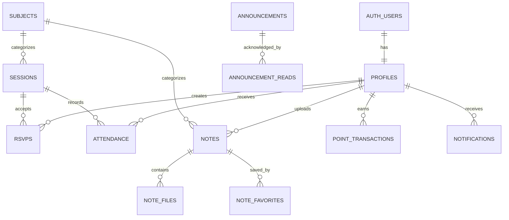

# Data model and ownership

## Canonical identity rule

`auth.users.id`, `profiles.id`, and every product `user_id` must be the same UUID. `student_id` is a display/login identifier, not a relational key.

## Entity map

## Table ownership matrix

| Table | Student | Admin | Public/anonymous |
|---|---|---|---|
| `profiles` | Read own; update via whitelisted RPC | Read/update all | None |
| `subjects` | Read active | CRUD | Read active if events remain public |
| `sessions` | Read published | CRUD, including drafts | Read published |
| `rsvps` | Read own; join/cancel via RPC | Read all | None |
| `attendance` | Read own; check in via RPC | Read/moderate via RPC | None |
| `notes` | Read approved eligible notes and own submissions | Read/moderate all | None in Phase 1 |
| `note_files` | Read eligible/owned metadata | Read all | None |
| `note_favorites` | Own rows only | Optional reporting | None |
| `point_transactions` | Read own | Read all; adjust via RPC | None |
| `point_rules` | Read active rules | Update | Read if points guide is public |
| `notifications` | Read/mark own | System creates | None |
| `announcements` | Read eligible published | CRUD | Optional published/all only |
| `user_preferences` | Own row only | No need | None |
| `saved_sessions` | Own rows only | No need | None |

## Constraints that belong in the database

- Unique `(session_id, user_id)` for RSVP and attendance.
- Positive session capacity and end time after start time.
- Allowed values for profile role/year, session status, attendance status/method/arrival, and note status.
- Foreign keys with intentional delete behavior.
- Unique subject code.
- Unique note file storage path.
- Point rules with one code per award type.
- Point transactions as an append-only ledger.

## Private data

Keep these out of exposed tables:

- attendance code hashes (`private.session_secrets`)
- opaque QR credential hashes (`private.attendance_qr_tokens`)
- any provisioning secrets or service keys

The public schema is exposed to the Data API by default in many projects. Grants determine whether a role can reach an object; RLS determines which rows it may use. Both must be configured. See [Securing your API](https://supabase.com/docs/guides/api/securing-your-api).

## Indexes

Add indexes for every common filter/foreign key path:

- sessions by `(status, date)` and `subject_id`
- RSVPs by `user_id` and `session_id`
- attendance by `user_id`, `session_id`, and `status`
- notes by `(status, subject_id, updated_at)` and `uploader_id`
- point transactions by `(user_id, created_at desc)`
- notifications by `(user_id, read_at, created_at desc)`

Do not add indexes speculatively beyond these known query paths; review production query plans later.
