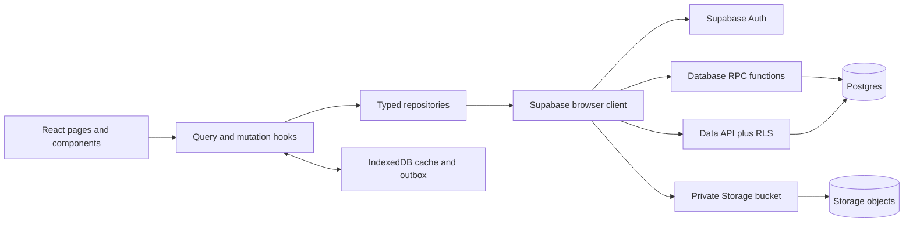

# Target architecture

## Responsibility boundaries

### React UI

- Renders state and accessible feedback.
- Performs friendly client validation for immediate feedback.
- Never decides whether a database action is authorized.
- Never calculates authoritative capacity, attendance, or point balances.

### Query/mutation layer

- Owns loading, error, retry, optimistic, and reconciliation states.
- Separates server state from purely local UI state.
- Invalidates or refreshes affected queries after a mutation.

The current app can first implement this with focused hooks and its context. A dedicated server-state library can be introduced later if it reduces complexity; it is not a prerequisite for the backend cutover.

### Repositories

- Are the only modules aware of Supabase table/column names.
- Return domain objects or well-defined application errors.
- Call ordinary table operations for safe reads and RPC functions for sensitive/transactional writes.

### Postgres and RLS

- Store the canonical data.
- Enforce ownership, role, active-account, audience, and lifecycle rules.
- Provide atomic behavior for capacity, duplicate prevention, moderation, and point awards.

### IndexedDB

- Stores a cache for useful offline reads.
- Stores an outbox for operations that are safe to replay.
- Does not grant authority and does not overwrite newer server data without version checks.

## Direct table access versus RPC

| Operation | Interface | Reason |
|---|---|---|
| Read published sessions/subjects | Table select | Simple, cacheable, protected by RLS |
| Read own profile/history/preferences | Table select | Ownership policy is sufficient |
| Admin session CRUD | Table insert/update/delete | Admin RLS is sufficient; attendance secret set separately |
| Join/cancel RSVP | `set_rsvp` RPC | Capacity and lifecycle checks must be atomic |
| Student code check-in | `check_in_with_code` RPC | Secret verification and time window belong on server |
| Issue/consume QR | RPC | Credential must be opaque, expiring, and single-use |
| Moderate attendance/note | RPC | Status, audit fields, notifications, and points change together |
| Adjust points | RPC | Ledger must be append-only and audited |
| Note file transfer | Storage API | Binary objects do not belong in Postgres |
| Account provisioning | Dashboard or server-only Edge Function | Requires privileged Auth Admin API |

## Edge Functions

Do not add an Edge Function to every CRUD operation. Use one when a workflow requires a secret/service key, an external API, email, a webhook, or file processing. Account provisioning is the clear Phase 1 candidate. Data-intensive atomic operations are better as database functions.

Current Supabase guidance keeps authenticated function calls scoped to the user's JWT/RLS context and reserves admin access for explicit trusted work. See [Securing Edge Functions](https://supabase.com/docs/guides/functions/auth).

Next: [[02 Architecture/Data Model and Ownership]].
