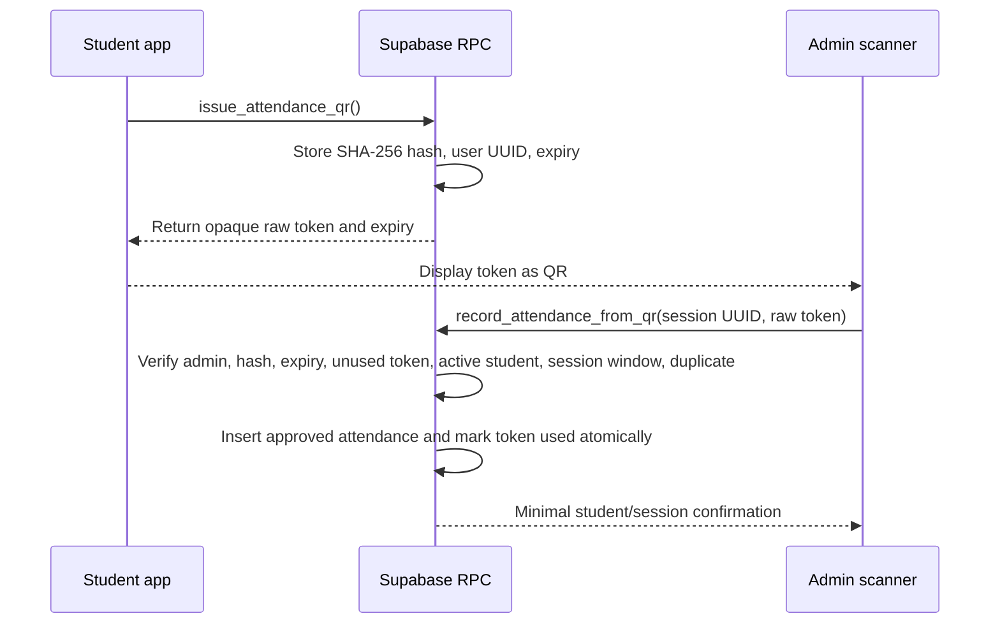

# QR attendance design

## Problem with the current payload

The current QR contains the Auth UUID, student ID, a random nonce, issued time, and expiry. It is generated entirely by the browser and has no signature or server record. A forged QR can replace the identity fields and create a fresh nonce/timestamp.

## Recommended flow

## Credential properties

- Opaque: the QR reveals no student ID or Auth UUID.
- Random: at least 256 bits generated server-side.
- Stored only as a SHA-256 hash.
- Expires after five minutes.
- Single-use.
- Bound to the student automatically from `auth.uid()`.
- Consumed only by an active admin.

The current “personal QR plus admin-selected session” user experience is preserved. If product requirements later make the student select a session, add `session_id` to the issued token record and verify the same session on consumption.

## Backend checks

The consumption RPC must execute in one transaction and:

1. Require an authenticated active admin.
2. Hash the provided token and lock the matching token row.
3. Reject missing, expired, or already-used credentials.
4. Reject an inactive/missing student profile.
5. Lock and verify a non-draft/non-cancelled session.
6. Enforce an attendance window (default in the migration: 30 minutes before start through 60 minutes after end).
7. Reject duplicate `(session_id, user_id)` attendance.
8. Calculate arrival on the server.
9. Insert approved attendance with reviewer/audit timestamps.
10. Mark the QR token used.

## Frontend changes

- `StudentAttendanceQr` becomes asynchronous and requests a token from the repository.
- Render the token and use the server expiry; do not embed profile fields.
- Refresh explicitly or when expired.
- `AdminStudentQrScanner` parses no identity. It sends the scanned raw token and selected session UUID to the RPC.
- Display the returned sanitized student name/ID only after the server accepts the token.
- Remove `buildStudentAttendanceQrPayload` and `parseStudentAttendanceQrPayload` after cutover.

## Offline behavior

The student can continue displaying the last issued QR without a connection until it expires. The admin scanner must be online for Phase 1 so it can atomically validate/consume the credential. Queuing admin attendance offline would require a separately signed credential plus replay/idempotency design and is not justified for the initial release.

## Abuse controls

- Issue at most one active token per user or rate-limit repeated issuance.
- Delete expired/used tokens on a scheduled maintenance job.
- Log failed consumption categories without logging raw tokens.
- Keep camera pages on HTTPS or localhost.
- Do not store the raw token in analytics, error reporting, or long-lived localStorage.
