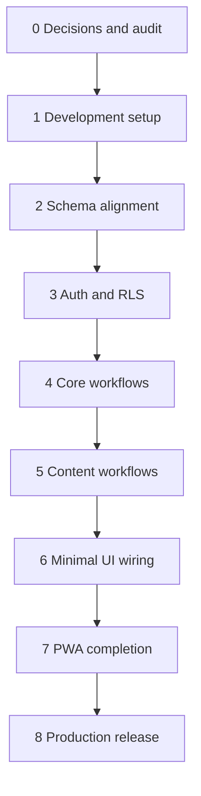

# START HERE — implementation roadmap

This is the operating guide for turning the finished frontend into a production Supabase application. Work in order. Do not start a phase until the prior phase's exit gate passes.

## Phase board

| Phase | Focus | Main output | Status |
|---:|---|---|---|
| 0 | [[07 Phase Playbooks/Phase 0 - Baseline and Decisions]] | Approved rules, backup, preflight report | Not started |
| 1 | [[07 Phase Playbooks/Phase 1 - Supabase Development Setup]] | Reproducible local/staging migration workflow | Not started |
| 2 | [[07 Phase Playbooks/Phase 2 - Schema and Data Alignment]] | Complete relational schema and UUID backfill | Not started |
| 3 | [[07 Phase Playbooks/Phase 3 - Authentication RLS and Provisioning]] | Secure identity, policies, and account process | Not started |
| 4 | [[07 Phase Playbooks/Phase 4 - Sessions RSVP and Attendance]] | Working core backend and secure QR | Not started |
| 5 | [[07 Phase Playbooks/Phase 5 - Notes Storage Points and Notifications]] | Content, private files, moderation, ledger | Not started |
| 6 | [[07 Phase Playbooks/Phase 6 - Minimal Frontend Wiring]] | Existing UI connected to canonical backend | Not started |
| 7 | [[07 Phase Playbooks/Phase 7 - PWA and Offline Reliability]] | Install/update/offline experience | Not started |
| 8 | [[07 Phase Playbooks/Phase 8 - Release and Operations]] | Production launch, monitoring, cleanup | Not started |

## Working rule

For every phase:

1. Read the phase note.
2. Confirm prerequisites.
3. Create a branch and a generated migration when schema changes are involved.
4. Apply to local/staging only.
5. Run the exact verification gate.
6. Record evidence and commit.
7. Move to the next phase only when all required boxes pass.

## Backend-first sequence

## What not to change

The frontend visual design, navigation, responsive layout, and established workflows are treated as final. Change UI code only when required to:

- wait for real backend results;
- show loading/error/pending states;
- use Auth UUIDs;
- call safe repositories/RPCs;
- surface sync/install/update status.

Avoid a design-system rewrite, page redesign, router replacement, or unrelated dependency upgrade during the backend project.

## Recommended branch strategy

- One long-lived integration branch for the backend program.
- One short branch per phase or vertical slice.
- One migration per coherent schema/security change.
- Do not combine dependency upgrades with RLS changes.
- Commit generated database types after the schema stabilizes.

## Completion definition

The backend is complete when:

- all product data is canonical in Supabase;
- every exposed table has tested RLS and minimum grants;
- all sensitive writes use atomic database/Edge functions;
- frontend success messages reflect confirmed writes;
- cross-device state matches;
- offline replay is deterministic;
- no secret or predictable credential is shipped to the browser;
- staging rehearsal and production runbook both pass.
